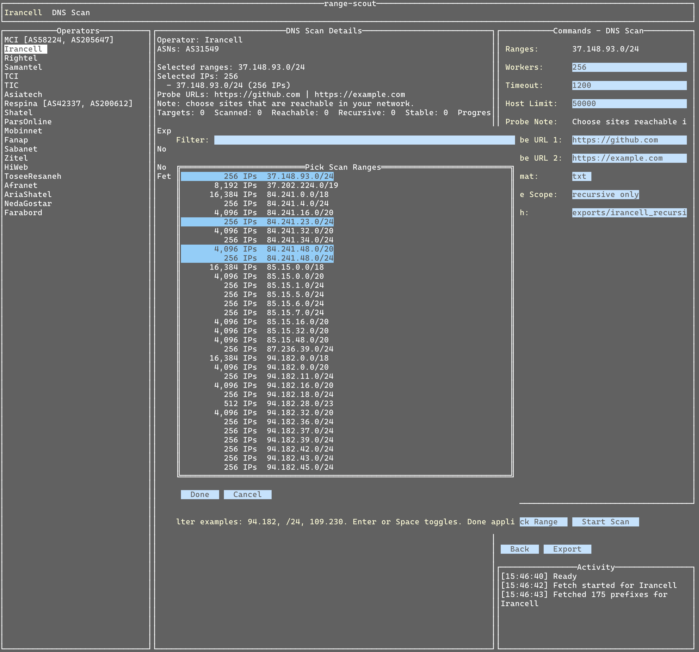

# range-scout

`range-scout` is a small TUI for:

- fetching announced IPv4 prefixes for supported Iranian operators from RIPEstat
- choosing one or more ranges to scan
- checking which hosts on that range answer on DNS and allow recursion
- exporting prefixes or scan results on demand as `txt`, `csv`, or `json`

## Screenshot



## What It Does

1. Fetches IPv4 prefixes for a selected operator from RIPEstat.
2. Lets you choose one or more CIDR ranges from that operator.
3. Scans hosts in those ranges over UDP, TCP, or both on a configurable port (default `53`).
4. Marks hosts as:
   - `dns reachable`
   - `recursive`
   - `stable` if both probe sites resolve successfully

## Build

Requires Go `1.24.0` or newer.

```bash
go build -o range-scout .
```

## Run

```bash
./range-scout
```

For a one-off run without building:

```bash
go run .
```

## Quick Guide

1. Select an operator from the left sidebar.
2. Click `Fetch` to load its prefixes.
3. Click `Scan Setup`.
4. Click `Pick Range`, use the filter box if needed, and choose one or more CIDRs.
5. Set the port, protocol, and probe URLs.
   Choose sites that are reachable in your network.
6. Click `Start Scan`.
7. Click `Export` if you want to save scan results.
8. In prefix mode, click `Save` if you want to save prefixes.

## Shortcuts

- `p`: prefix view
- `d`: scan setup
- `f`: fetch prefixes
- `s`: save or export current data
- `g`: start scan
- `x`: stop scan
- `Tab` / `Shift+Tab`: move focus
- `Esc`: leave an input field
- `q`: exit

## Notes

- IPv4 only
- Operator definitions are compiled into the app
- Files are saved only on demand
- The scanner supports UDP, TCP, or BOTH DNS probes and defaults to port `53`
